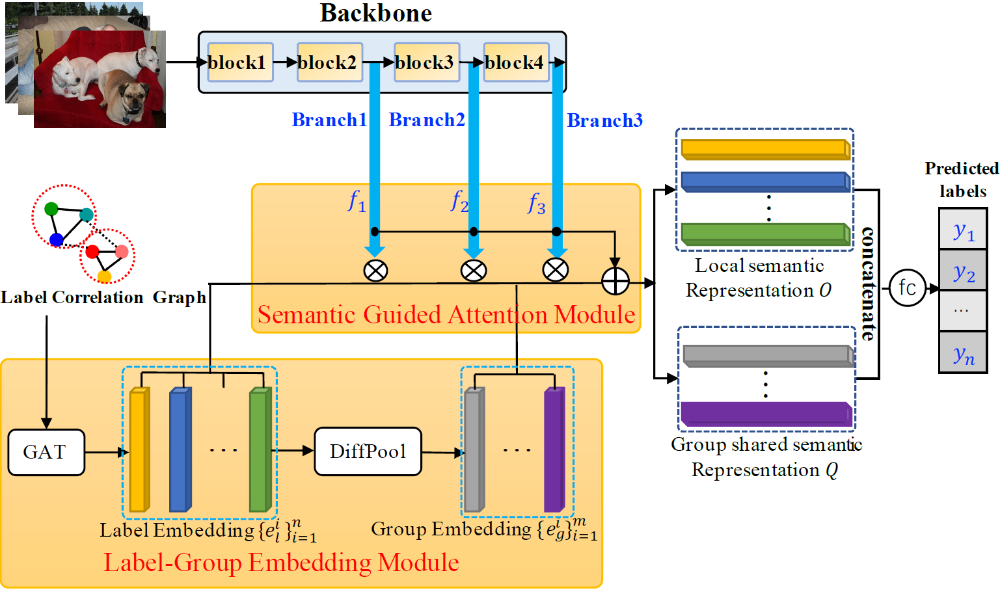

# MSRN.pytorch

Official PyTorch Implementation
of [MULTI-LAYERED SEMANTIC REPRESENTATION NETWORK FOR MULTI-LABEL IMAGE CLASSIFICATION](https://arxiv.org/......).

**Abstract**
> Multi-label image classification (MLIC) is a fundamental and
> practical task, which aims to assign multiple possible labels
> to an image. In recent years, many deep convolutional neural
> network (CNN) based approaches have been proposed
> which model label correlations to discover semantics of labels
> and learn semantic representations of images. This paper
> advances this research direction by improving both the modeling
> of label correlations and the learning of semantic representations.
> On the one hand, besides local semantics of each
> label, we propose to further explore global semantics shared
> by multiple labels. On the other hand, existing approaches
> mainly learn the semantic representations at the last convolutional
> layer of a CNN. But it has been noted that the image
> representations of different layers of CNN capture different
> levels or scales of features and have different discriminative
> abilities. We thus propose to learn semantic representations at
> multiple convolutional layers. To this end, this paper designs
> a Multi-layered Semantic Representation Network (MSRN)
> which discovers both local and global semantics of labels
> through modeling label correlations and utilizes the label semantics
> to guide the semantic representations learning at multiple
> layers through an attention mechanism. Extensive experiments
> on four benchmark datasets including VOC 2007,
> COCO, NUS-WIDE and Apparel show a competitive performance
> of the proposed MSRN against state-of-the-art models.

<p align="center">
 <table class="tg">
  <tr>
    <td class="tg-c3ow"></td>
  </tr>
</table>
</p>

## Preparing for running the code

### 1. Requirements

Please install the following packages

- python==3.6
- numpy==1.19.5
- torch==1.7.0+cu101
- torchnet==0.0.4
- torchvision==0.8.1+cu101
- tqdm==4.41.1
- prefetch-generator==1.0.1

### 2. Download ResNet-101 pretrained model

Download url: https://download.pytorch.org/models/resnet101-5d3b4d8f.pth
Please rename the model to resnet101.pth.tar, and put it to folder `pretrained`:
!mkdir pretrained
!cp -p /path/resnet101.pth.tar /path/MSRN/pretrained

### 3. Download datasets

#### Pascal VOC2007

http://host.robots.ox.ac.uk/pascal/VOC/voc2007/

#### MS-COCO 2014

https://cocodataset.org/#download

#### NUS-WIDE

Refer to: https://github.com/Alibaba-MIIL/ASL/blob/main/MODEL_ZOO.md

#### Apparel

https://www.kaggle.com/kaiska/apparel-dataset

### 4. Download pretrained models

checkpoint/voc ([GoogleDrive](https://drive.google.com/file/d/1--QgXcZiR6iI-luAT7FdiGBjWogM07xK/view?usp=sharing))

checkpoint/coco ([GoogleDrive](https://drive.google.com/file/d/1x-pSlk6VCEeUgP8ngKXwd07lHxxA6H49/view?usp=sharing))

checkpoint/nus-wide ([GoogleDrive](https://drive.google.com/file/d/1AvXK8j2Pu9YtvmBkKCtUgPQA3xI7Dtxc/view?usp=sharing))

checkpoint/Apparel ([GoogleDrive](https://drive.google.com/file/d/1yfFoAAVL8vb_8F39nErPnXiN9ibQJrzN/view?usp=sharing))

or

[Baidu](https://pan.baidu.com/s/1jgaSxURuxR1Z3AV_-hJ-KA 提取码：1qes )

## Run the code

### Options

- `lr`: learning rate
- `batch-size`: number of images per batch
- `image-size`: size of the image
- `epochs`: number of training epochs
- `e`: evaluate model on testing set
- `resume`: path to checkpoint

### Demo VOC 2007
```
python3 demo_voc2007_gcn.py data/voc --image-size 448 --batch-size 24 -e --resume checkpoint/voc/voc_checkpoint.pth.tar
```

### Demo COCO 2014

```
python3 demo_coco_gcn.py data/coco --image-size 448 --batch-size 12 -e --resume checkpoint/coco/coco_checkpoint.pth.tar
```

### Demo NUS-WIDE

```
python3 demo_coco_gcn.py data/coco --image-size 448 --batch-size 12 -e --resume checkpoint/nuswide/nuswide_checkpoint.pth.tar
```

### Demo Apparel

```
python3 demo_apparel_gcn.py data/coco --image-size 448 --batch-size 12 -e --resume checkpoint/apparel/apparel_checkpoint.pth.tar
```

## Citing this repository

```
@inproceedings{2021MSRN,
author = {},
title = {},
booktitle = {},
year = {}
}
```
